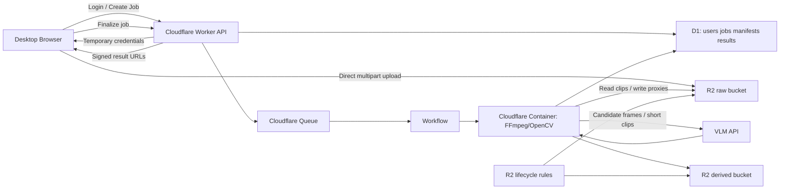

# Teslaセントリー映像AI点検サービス 計画書

更新：2026-08-03 JST
状態：構想整理・MVP設計前
仮称：**Sentry Check（仮）**

---

## 0. 現時点の結論

このサービスは、**専用デバイスもネイティブアプリも使わず、Webだけで成立させられる可能性が高い**。

ユーザーに提供する価値は「動画を再生しやすくすること」ではなく、次の一文に集約される。

> USBメモリ・SSD・SDカードをPCにつなぎ、TeslaCamフォルダを選ぶだけで、数百本のセントリー映像から本当に確認すべき数秒だけを抽出する。

推奨する初期方針は以下。

- PC向けWebサービスとして提供する
- Teslaアカウント連携や車載デバイスは使わない
- `TeslaCam/SentryClips` を既定の解析対象にする
- ブラウザからCloudflare R2へ直接、再開可能な分割アップロードを行う
- 元動画は解析完了後に早期削除し、確認用画像・短いプレビューだけ最大7日保持する
- 「接触した／していない」を断定するのではなく、**接触・傷つけ・不審行動の可能性がある候補を高い再現率で絞り込む**
- 年額2,000円はβ価格として十分検討可能。ただし、**1TBを何度でも無制限に送れるプランにはしない**
- コストと精度の両面から、全動画をそのまま高性能VLMに投げるのではなく、古典的な映像解析で候補区間を絞った後にAIを使う

特に重要なのは、Cloudflare R2の保管料よりも次の3点である。

1. ユーザー側のアップロード時間
2. 動画前処理とAI推論の量
3. 誤検知ではなく、見逃しに対する信頼設計

---

## 1. 解決する問題

Teslaのセントリーモードは録画してくれるが、ユーザーは実際には次の理由でほとんど確認できない。

- 1イベントに複数カメラの動画が含まれる
- セントリーが頻繁に反応し、ほとんどが通行人や近接駐車などの無害な映像
- 「バイクや隣のドアがかなり近いが、当たったか分からない」という曖昧な映像が最も確認に時間を使う
- 傷を見つけた後に過去映像を探そうとしても、対象時刻やイベントを特定しにくい
- 録画されている安心感はあるが、見ていないので実質的には未確認のまま

このサービスの役割は「監視カメラAI」より、**大量の映像を代わりに棚卸しする検品サービス**に近い。

### ユーザーが本当に欲しい結果

- 「今回の238イベントに、高リスクな場面は見つかりませんでした」
- 「確認が必要なのはこの3件だけです」
- 「13秒付近で二輪車が右側面に最接近しています」
- 「映像上は接触を示す揺れや軌道変化はありませんが、死角があるため右後部ドアを目視してください」

---

## 2. プロダクトの約束

### 一行説明

> **100本のセントリー映像を、見るべき3本にする。**

### 提供するもの

- 複数カメラ映像の自動整理
- 人、車、バイク、自転車、カート、荷物、ドアなどの近接イベント抽出
- 車体への接触可能性、傷つけ行為、不審行動の分類
- 要確認区間の短いプレビュー
- なぜ候補になったかを示す根拠
- 目視すべき車体部位
- 必要に応じた証拠用タイムラインの書き出し

### 提供しないもの

- 「絶対に接触していない」という保証
- 損傷の有無の法的・保険的な確定
- Tesla車両のリアルタイム監視
- Teslaアカウントへの常時アクセス
- 車載デバイスの販売・設置
- 映像を長期間保管するクラウドストレージ

---

## 3. 用語の定義

実装と料金設計で混乱しないよう、次の単位を分ける。

| 用語 | 意味 |
|---|---|
| ジョブ | ユーザーが一度にアップロードして解析するまとまり |
| イベント | 一つの日時に発生したセントリーイベント |
| クリップ | 一台のカメラが記録した一つの動画ファイル |
| カメラ時間 | 1カメラ分の動画時間。4カメラ×10分なら40カメラ分 |
| 候補区間 | 接触や不審行動の可能性があり、詳細解析する数秒〜数十秒 |
| 元動画 | ユーザーがアップロードしたMP4等 |
| 派生データ | サムネイル、低解像度プレビュー、解析結果、レポート |

「100動画」は、4カメラ構成なら約25イベントの場合もある。料金とコストはファイル数より、**総動画時間と総容量**の影響を受ける。

---

## 4. 想定ユーザー

### 最初の対象

- Tesla Model 3 / Model Yの個人オーナー
- セントリーモードを常時利用している
- USBメモリやSSDをPCに接続できる
- 車体の傷やドアパンを気にする
- 録画はしているが、普段はほとんど見ていない

### 後から広げられる対象

- 高級車・旧車のオーナー
- 複数台を持つ個人
- カーシェア・レンタカー・社用車
- 板金・コーティング・保険関連事業者
- 一般ドラレコや防犯カメラの大量映像確認

ただしMVPではTeslaに絞る。フォルダ構造、ファイル名、カメラ位置が比較的統一されるため、汎用ドラレコより実装と評価が容易になる。

---

## 5. 基本ユーザーフロー

1. ユーザーがTeslaからUSBメモリ・SSD・SDカードを取り外す
2. PCに接続する
3. Webサイトを開き、年額プランに登録する
4. 「TeslaCamフォルダを選択」を押す
5. ブラウザがローカルでフォルダ構造を読み取る
6. 次の事前確認画面を表示する
   - イベント数
   - 動画ファイル数
   - 合計容量
   - 合計カメラ時間
   - 暗号化・破損・未対応ファイル
   - 推定アップロード時間
   - 今回の料金／年間利用量
7. ユーザーが解析対象を確認する
8. ブラウザからR2へ直接アップロードする
9. 画面を閉じても、再度同じフォルダを選べば途中から再開できる
10. 解析が完了するとメールまたはWeb通知を受け取る
11. 結果画面で次を確認する
    - 問題なし
    - 低リスクだが確認推奨
    - 接触可能性あり
    - 不審行動
    - 判定不能
12. 必要な映像だけ再生・ダウンロードする
13. ユーザーが即時削除するか、自動削除を待つ

### 画面で最初に伝えるべきこと

> 動画はTeslaや当サービスへ自動送信されません。
> ユーザーが選んだファイルだけを解析し、元動画は解析後に削除します。

---

## 6. 結果画面の理想形

### サマリー

```text
解析対象：112イベント / 448クリップ
解析結果：
  問題なし                103件
  近接・要確認              7件
  接触可能性あり            1件
  判定不能                  1件

推定確認時間：48秒
```

### 今回共有された二輪車の映像に近い出力例

```text
判定：接触可能性は低いが、近接イベントとして確認推奨
対象：二輪車
カメラ：右側面 / 後方
要確認区間：00:12.6〜00:14.2

接触を強く示す所見：
- 車体全体の瞬間的な揺れは検出されず
- 二輪車の軌道に急な変化は見られず
- ライダーの振り返りや反応は見られず

不確実性：
- 車体の一部が死角に入る
- 音声がない
- 最接近部分が短時間で、完全な否定はできない

推奨：
- 右側ドア、右後部フェンダー、ミラー周辺を斜めから目視
```

### 判定ラベル

ユーザーには細かな数値確率より、理解しやすい帯域を見せる。

| ラベル | 意味 | ユーザー行動 |
|---|---|---|
| 問題なし | 問題を示す所見を検出しなかった | 原則確認不要 |
| 近接・要確認 | 車体へ近づいたが、接触所見は弱い | 短い映像を確認 |
| 接触可能性あり | 接触を示す複数の所見がある | 映像と車体を確認 |
| 不審行動 | 触る、叩く、覗く、長時間滞留など | 映像を保存 |
| 判定不能 | 死角、破損、暗所、遮蔽など | 人間が確認 |

「信頼度78%」のような数字は、物理的な接触確率と誤解されやすい。内部スコアとしては保持しても、初期UIでは帯域表示を基本とする。

---

## 7. 検出対象

### MVPで優先するもの

1. 隣の車のドアが自車へ接近する
2. バイク・自転車・カート・荷物が自車の側面を近接通過する
3. 人が車体、ドアハンドル、ミラーへ手を伸ばす
4. 車体を叩く、蹴る、擦る、物を当てる
5. 車両が前後から異常に近づく
6. 接触前後に画面全体の衝撃・揺れが生じる
7. 接触後に相手が振り返る、立ち止まる、逃げる
8. 長時間の徘徊や車内の覗き込み

### 後回しにするもの

- 傷そのものの画像認識
- ナンバーの完全な自動認識
- 車種や人物の詳細特定
- 音声による衝突音検出
- 事故の責任割合判定
- 警察・保険会社への自動提出

傷は照明、汚れ、圧縮、車体色の影響が大きい。MVPでは「傷を見つける」より、**傷が発生した可能性のある行為を見つける**ことを中心にする。

---

## 8. 解析方式

### 基本思想

全動画をVLMへ丸ごと渡すだけでは、次の問題がある。

- 費用が利用量に比例する
- 1fps程度のサンプリングでは、一瞬の接触を見逃す可能性がある
- モデルは「近い」と「触れた」を安定して区別できない
- 複数カメラと車体揺れを構造化して扱いにくい
- 顔、ナンバー、位置情報を外部AIへ必要以上に送ることになる

したがって、**高再現率の機械的な候補抽出 → 候補区間だけ詳細解析 → VLMによる意味付け**の三段構成にする。

### Stage 1：ファイル整理

- TeslaCamの相対パスとファイル名を解析
- 日時とカメラ方向でグループ化
- MP4メタデータ、長さ、解像度、コーデックを取得
- 重複、破損、空ファイル、暗号化ファイルを検出
- イベント単位のタイムラインを生成

### Stage 2：安価な全体スキャン

FFmpeg、OpenCV、軽量物体検出モデルなどを利用し、次の特徴量を取得する。

- 人、車、二輪車、自転車、カート、ドア等の検出
- オブジェクトの軌跡
- 車体近傍への進入
- 画面内での最接近
- 背景を基準にした画面全体の揺れ
- 急な軌道変化
- 人物の手や物体の移動
- 長時間の滞留
- 遮蔽率、暗さ、雨、逆光などの品質指標

ここでは「安全」と断定せず、**詳細解析が不要そうな大量の区間を除外する**。

### Stage 3：候補区間の高密度解析

Stage 2で候補になった前後数秒についてのみ、12〜24fps相当で確認する。

- フレーム間の細かな動き
- 最接近前後の軌道
- 車体・カメラの瞬間的な振動
- オブジェクトの変形や跳ね返り
- 接触後の人物反応
- 他カメラ映像との整合性
- 死角に入った時間

### Stage 4：VLMによる説明と分類

VLMへ送るのは、原則として候補区間の代表フレーム、低解像度短尺動画、Stage 2の特徴量だけにする。

出力は自由文だけでなく、JSON Schemaで固定する。

```json
{
  "verdict": "near_miss",
  "severity": "review",
  "object_type": "motorcycle",
  "camera_views": ["right_repeater", "rear"],
  "review_window": {
    "start_ms": 12600,
    "end_ms": 14200
  },
  "evidence": {
    "visible_gap": "likely",
    "global_camera_shake": false,
    "trajectory_discontinuity": false,
    "human_reaction": false,
    "occlusion": "partial"
  },
  "uncertainty_reasons": [
    "closest point partially occluded",
    "no audio track"
  ],
  "recommended_action": "Inspect the right-side doors, rear fender, and mirror."
}
```

### Stage 5：ルール統合

最終判定はVLM一つに依存させず、次を統合する。

- 画像内の最接近
- 物体軌跡
- 画面全体の揺れ
- 高密度フレーム解析
- 他カメラとの一致
- VLM分類
- 映像品質と死角

初期はルールベースでよい。実データが蓄積した後に、接触／非接触の軽量分類器へ置き換える。

---

## 9. Webアップロード設計

### Webだけでフォルダを扱う

デスクトップブラウザでは、ディレクトリ選択によりユーザーが選んだフォルダ内のファイルと相対パスを読み取れる。初期はデスクトップChromeを推奨環境とし、他ブラウザにはフォルダ選択またはドラッグ＆ドロップのフォールバックを用意する。

ブラウザはユーザーが明示的に選んだファイルだけにアクセスする。サービス側がPC内や接続ドライブを勝手に走査することはできない。

### アップロード前のローカル処理

ファイル本体を送る前に、ブラウザ内で次を行う。

- `TeslaCam`、`SentryClips`、`SavedClips` の識別
- `RecentClips` を既定では除外
- ファイル名と相対パスからイベントをグループ化
- 合計容量と動画時間の計算
- 同一ファイルの簡易フィンガープリント
- 前回送信済みファイルとの重複判定
- 未対応・暗号化・破損の事前表示
- 回線速度からアップロード時間を推定

### R2への直接アップロード

大きな動画を通常のWorkerリクエストへ通すべきではない。Cloudflareのアカウントプランによって、Workerに入るリクエスト本文は100MB〜500MBに制限されるためである。

推奨フロー：

1. ブラウザがWorkerへジョブ作成を依頼
2. Workerがユーザー専用・ジョブ専用の短期資格情報または署名済みURLを発行
3. ブラウザがR2へ直接アップロード
4. 大きなファイルはmultipart uploadを使用
5. 各パートの完了情報をIndexedDBへ保存
6. 通信断やブラウザ再起動後、同じフォルダを再選択して再開
7. 全ファイル完了後、ブラウザがジョブ確定APIを呼ぶ
8. WorkerがmanifestとR2上のオブジェクトを照合してQueueへ投入

親R2資格情報をブラウザへ埋め込んではならない。資格情報は特定のバケット、プレフィックス、操作、短い有効期間へ限定する。

### Multipartの推奨初期値

- 100MB未満：単一PUT
- 100MB以上：multipart
- パートサイズ：32〜64MiB
- 同時送信：3〜4本
- リトライ：指数バックオフ
- 不完全アップロード：1日で自動破棄
- 完全な元動画：解析完了後に明示削除、7日ライフサイクルを安全網として設定

Cloudflare R2はmultipartで最大5TiBのオブジェクトを扱え、失敗したパートだけを再送できる。ただし、1ファイルの大きさと「1回のジョブ全体の大きさ」は別問題である。

---

## 10. 1TBアップロード問題

### 回線がボトルネックになる

1TBを送る理論時間は次の通り。実際にはプロトコル、Wi‑Fi、PCのスリープ、再送等を考慮し、約15%の余裕を加えた。

| 実効上り速度 | 1TBの理論時間 | 現実的な目安 |
|---:|---:|---:|
| 20Mbps | 約111時間 | 約128時間 |
| 50Mbps | 約44時間 | 約51時間 |
| 100Mbps | 約22時間 | 約26時間 |
| 300Mbps | 約7.4時間 | 約8.5時間 |
| 500Mbps | 約4.4時間 | 約5.1時間 |
| 1Gbps | 約2.2時間 | 約2.6時間 |

したがって、「1TB SSDを丸ごとアップロードしてください」は一般ユーザー向けUXとして成立しにくい。

### 解決策

#### MVP：対象フォルダを絞って元動画を送る

- 既定では`SentryClips`のみ
- `RecentClips`は除外
- 解析したい日付を選べる
- 1ジョブの上限を設ける
- 事前に推定時間を表示する
- 途中再開を必須にする

これは最も早く作れる。

#### 次段階：ブラウザで解析用プロキシを作る

アプリをインストールしなくても、WebCodecsやWASM版FFmpeg等を使い、ブラウザ上で次を生成できる可能性がある。

- 低解像度・低ビットレート動画
- 1〜2fpsの全体スキャン
- モーションがある区間だけの短尺プロキシ
- サムネイルとメタデータ

クラウドへ最初に送るのはプロキシだけにし、候補になった元動画または元動画の該当区間だけを追加送信する。

理想フロー：

1. ブラウザが全動画をローカルで軽く走査
2. 元動画の1〜5%程度の解析パッケージを送る
3. クラウドが候補イベントを返す
4. ブラウザが候補元動画だけ追加アップロード
5. 詳細解析する

ただし、ブラウザ内動画変換はCPU負荷、コーデック差、長時間実行、ページ終了の扱いが難しい。MVPの必須条件にはせず、利用量が確認できた後に実装する。

### 推奨判断

- 最初は「選択したSentryClipsの元動画アップロード」で検証する
- 1TB対応を最初の完成条件にしない
- 大量利用者が本当にいると分かってから、ブラウザ側プロキシ生成を作る
- 年2,000円プランで「元動画無制限」は掲げない

---

## 11. 推奨Cloudflare構成



### 各コンポーネント

| コンポーネント | 役割 |
|---|---|
| Workers / Pages | Web UI、認証、API、署名、権限制御 |
| D1 | ユーザー、契約、ジョブ、manifest、解析結果 |
| R2 `raw` | 一時的な元動画 |
| R2 `derived` | サムネイル、候補短尺、レポート |
| Queues | 解析ジョブのバッファとリトライ |
| Workflows | 長時間処理の状態管理、再開、外部API待機 |
| Containers | FFmpeg、OpenCV、物体検出、プロキシ作成 |
| VLM API | 候補区間の意味理解と説明生成 |
| Stripe等 | 年払いの決済と契約状態 |

### ジョブ起動方式

R2の各ファイル作成イベントごとに解析を始めると、未完了ジョブや大量のQueueメッセージが発生しやすい。MVPでは次を推奨する。

- アップロード完了後にユーザー側が`finalize`を呼ぶ
- Workerがmanifestの全オブジェクトを確認
- 一つのジョブ単位でQueue / Workflowを開始
- R2イベント通知は監査、進捗補助、異常検知に使う

### Container利用時の注意

Cloudflare ContainersはFFmpeg等を動かせるが、1インスタンスのディスクは最大20GBで、ディスクは一時的である。そのため、50GBや1TBのジョブ全体を一度にダウンロードしない。

- 1クリップずつストリーミング処理する
- R2 Range ReadまたはHTTP入力を使う
- 一時ファイルを処理後すぐ削除する
- 中間成果物はR2へ戻す
- ジョブの状態はD1 / Workflowへ保存する
- コンテナの再起動を前提に冪等化する

---

## 12. データモデル

### 最小テーブル

#### `users`

- `id`
- `email`
- `created_at`
- `deleted_at`

#### `subscriptions`

- `user_id`
- `provider_customer_id`
- `provider_subscription_id`
- `plan`
- `status`
- `current_period_end`

#### `jobs`

- `id`
- `user_id`
- `status`
- `source_type`
- `total_files`
- `total_bytes`
- `total_duration_ms`
- `camera_duration_ms`
- `created_at`
- `finalized_at`
- `completed_at`
- `expires_at`
- `failure_reason`

#### `job_files`

- `id`
- `job_id`
- `relative_path`
- `r2_key`
- `size_bytes`
- `mtime`
- `fingerprint`
- `camera`
- `captured_at`
- `duration_ms`
- `upload_status`
- `analysis_status`

#### `sentry_events`

- `id`
- `job_id`
- `captured_at`
- `clip_count`
- `camera_duration_ms`
- `quality_flags`

#### `analysis_results`

- `id`
- `event_id`
- `verdict`
- `severity`
- `review_start_ms`
- `review_end_ms`
- `evidence_json`
- `uncertainty_json`
- `recommended_action`
- `model_version`
- `pipeline_version`
- `created_at`

#### `deletion_audits`

- `id`
- `job_id`
- `object_prefix`
- `requested_at`
- `completed_at`
- `reason`

### ジョブ状態

```text
draft
  -> uploading
  -> uploaded
  -> queued
  -> preprocessing
  -> analyzing
  -> completed
  -> expiring
  -> expired

任意の段階
  -> failed
  -> canceled
```

各処理は同じジョブを再実行しても重複課金・重複生成しないよう、冪等キーを持つ。

---

## 13. API案

```text
POST   /api/jobs
GET    /api/jobs/:jobId
POST   /api/jobs/:jobId/upload-credentials
POST   /api/jobs/:jobId/files/register
POST   /api/jobs/:jobId/finalize
POST   /api/jobs/:jobId/cancel
GET    /api/jobs/:jobId/progress
GET    /api/jobs/:jobId/results
GET    /api/events/:eventId
POST   /api/jobs/:jobId/delete
POST   /api/events/:eventId/export
POST   /api/webhooks/billing
```

### `POST /api/jobs/:jobId/finalize`で確認すること

- ジョブ所有者
- 契約状態
- 年間利用上限
- manifestの署名
- R2オブジェクトの存在とサイズ
- 同じファイルの二重登録
- ファイル形式
- 1ファイルとジョブ全体の上限
- 悪意あるファイル名、パストラバーサル
- 解析開始前の同意状態

---

## 14. データ保持方針

ユーザーが「1週間でよい」と考えている点は、コストとプライバシーの両方で強い。

### 推奨保持期間

| データ | 推奨 |
|---|---|
| 未完了multipart | 1日で破棄 |
| 元動画 | 解析完了後すぐ削除。失敗時を含む最長7日 |
| 候補の低解像度プレビュー | 7日 |
| サムネイル・重要フレーム | 7日 |
| ダウンロード用レポート | 7日 |
| テキスト解析結果 | 90日〜契約中。ユーザー選択可 |
| 課金・同意・削除監査ログ | 法務・会計上必要な期間 |
| 学習用データ | 明示的な別同意がある場合のみ別保管 |

### R2プレフィックス

```text
raw/{userId}/{jobId}/...
derived/{userId}/{jobId}/...
exports/{userId}/{jobId}/...
dataset-optin/{datasetId}/...
```

- `raw/`：7日で削除するライフサイクルを安全網として設定
- `derived/`：7日で削除
- `exports/`：7日で削除
- 解析成功時はライフサイクルを待たず、元動画を明示的に削除
- UIに「削除済み」ではなく、実際の削除完了を確認した状態を表示する

R2のライフサイクル削除は指定時刻ぴったりではなく、通常はその後24時間程度の遅延があり得るため、利用規約と画面表示も「期限後に削除処理」と表現する。

### 学習利用

初期ユーザーの映像は最大の競争優位になり得るが、既定で学習へ流用してはいけない。

推奨：

- 通常契約：学習利用なし
- 任意オプトイン：「匿名化した候補区間を精度改善に提供」
- 顔・ナンバー・位置情報のマスキング
- 提供したクリップを後から削除できるID管理
- 同意時点、文面、対象データを監査可能にする

---

## 15. 暗号化されたTesla映像

一部地域・車両構成・ソフトウェアでは、Dashcam映像をUSB上で暗号化できる。暗号化されたクリップは、録画した車両または録画時に紐づいていたTeslaアカウントでしか閲覧できない。

このサービスはTeslaアカウントを預からない方針なので、MVPでは次の扱いが安全。

- 暗号化ファイルを事前検出する
- アップロード前に「このファイルは解析できません」と表示する
- ユーザーが車両側で復号・書き出した映像だけを受け付ける
- Tesla認証情報の入力を求めない
- 復号処理を非公式に実装しない

---

## 16. Cloudflareコスト概算

### 前提

- 2026-08-03時点のCloudflare R2 Standard料金
- 保管料：`$0.015 / GB-month`
- R2からインターネットへのegress：無料
- 為替は計画用に`$1 = 150円`と仮定
- 無料枠は保守的に無視
- オペレーション費、決済費、税、サポート費は別
- 1か月を30日として計算

### 固定費

Cloudflare Containersを使うにはWorkers Paidプランが必要で、基本料金は`$5 / 月`。計画上の為替では約750円/月、約9,000円/年になる。

| 有料ユーザー | 固定費の1人あたり年負担 |
|---:|---:|
| 10人 | 約900円 |
| 100人 | 約90円 |
| 1,000人 | 約9円 |

β初期はこの固定費の比率が大きいが、100人を超えると主要論点ではなくなる。Workers Paidには一定量のWorkers・Containers利用枠が含まれるため、最初の小規模検証は基本料金内に収まる可能性がある。

### Container前処理費

Workers Paidの含有量を超えたCloudflare Containersは、CPU、メモリ、ディスクの稼働時間で課金される。例として`standard-2`相当（1 vCPU、6GiBメモリ、12GBディスク）を1時間連続稼働させた場合、含有枠超過後の単純計算は約`$0.13 / 時間`、150円換算で約19円/時間となる。

これは「1時間の動画を処理する費用」ではなく、「コンテナが1時間稼働した費用」である。FFmpeg・物体検出の実時間倍率によって動画1時間あたりの原価は変わるため、実映像で次を計測する。

- 1カメラ時間を処理するコンテナ秒数
- 同時実行時のCPU利用率
- R2 Range Read量
- 一時ディスク量
- 候補区間生成後の外部AI送信量

### 7日間保管した場合

計算式：

```text
容量GB × 7 / 30 × $0.015
```

| 1回の保管量 | 7日分のR2保管料 | 150円換算 |
|---:|---:|---:|
| 1GB | $0.0035 | 約0.5円 |
| 10GB | $0.035 | 約5円 |
| 50GB | $0.175 | 約26円 |
| 100GB | $0.35 | 約53円 |
| 500GB | $1.75 | 約263円 |
| 1TB | $3.50 | 約525円 |

### 解釈

- 1人が1TBを一度だけ送り、7日で削除するなら保管料だけで約525円
- 年額2,000円でも一度だけなら不可能ではない
- しかし1TBを毎月送られると、保管料だけで年間約6,300円
- 解析、コンテナ、外部AI、決済、サポートを加える前に赤字になる
- したがって「無制限」ではなく、年間利用量または公正利用ポリシーが必要

R2のClass A/Bオペレーションは、数百〜数千ファイル程度では通常は保管料・推論料より小さい。ただしmultipartのパートを極端に細かくすると書き込み回数が増えるため、32〜64MiB程度のパートを使う。

---

## 17. AI推論コストの概算

### 現在の参考モデル

2026-08-03時点のGemini 2.5 Flash-Liteは、テキスト・画像・動画入力がStandardで`$0.10 / 100万tokens`、Batch/Flexで`$0.05 / 100万tokens`。

Googleの動画理解仕様では、動画は概ね次のトークン量になる。

- 低解像度相当：約100tokens/秒
- 既定解像度相当：約300tokens/秒

モデル、設定、音声、メタデータにより変わるため、これは計画用概算である。

### 1カメラ時間あたり

| 条件 | 1時間の入力費 | 150円換算 |
|---|---:|---:|
| 低解像度・Batch | $0.018 | 約2.7円 |
| 低解像度・Standard | $0.036 | 約5.4円 |
| 既定解像度・Batch | $0.054 | 約8.1円 |
| 既定解像度・Standard | $0.108 | 約16.2円 |

短いJSON出力の費用は比較的小さいが、thinkingや長文出力を許すと増えるため、出力長を制限する。

### 100イベントを全量VLMへ送る例

仮に1イベントが10分、4カメラなら：

```text
100イベント × 10分 × 4カメラ
= 4,000カメラ分
= 約66.7カメラ時間
```

入力費の概算：

| 条件 | 概算 |
|---|---:|
| 低解像度・Batch | 約180円 |
| 低解像度・Standard | 約360円 |
| 既定解像度・Batch | 約540円 |
| 既定解像度・Standard | 約1,080円 |

一見安いが、次の理由で全量VLM方式を採用すべきではない。

- 年に何度も解析すると積み上がる
- 車種・カメラ数・イベント数で増える
- 1fps中心の動画理解では一瞬の接触を見逃し得る
- 詳細判定には高密度フレームが必要
- 外部AIへ送る映像量が増える
- モデル価格変更の影響を直接受ける

### 目標原価

年額2,000円のβプランでは、平均ユーザーの年間変動原価を次に収めたい。

| 項目 | 目標 |
|---|---:|
| R2保管・操作 | 100円以内 |
| 動画前処理 | 100〜150円以内 |
| AI推論 | 200〜300円以内 |
| 通知・DB等 | 50円以内 |
| 合計変動原価 | 500円以内 |

これを実現するには、全量VLMではなく、Stage 2で95%以上の無害区間を安価に除外し、数%だけを詳細AIへ送る必要がある。

---

## 18. 料金案

### 推奨する最初のプラン

**年額2,000円（税込・β価格）**

- 1ユーザー
- Tesla 1台
- Webからの手動アップロード
- 元動画の短期保管
- 問題候補の自動抽出
- 7日間の結果閲覧
- テキスト結果の履歴
- SLAなし
- 精度改善中であることを明記
- 公正利用上限あり

### 公正利用上限の初期案

利用実績がない段階で「無制限」と表示しない。

候補：

- 1ジョブ最大100GB
- 年間合計300GB程度
- 年間300セントリーイベント程度
- いずれかを超える場合は追加パックまたは手動審査

ただし、GBだけでは動画時間が分からず、イベント数だけではカメラ数が分からない。内部では次の三つを必ず計測する。

- raw upload GB
- camera-hours
- detailed candidate seconds

公開上限はシンプルにし、内部では上記指標で原価を管理する。

### 追加収益候補

| 商品 | 価格案 | 内容 |
|---|---:|---|
| 追加解析パック | 500〜980円 | 年間上限超過分 |
| 高容量プラン | 年4,980円 | 2台・大容量 |
| 証拠レポート | 980〜2,980円/件 | 時刻、重要フレーム、複数カメラ、説明 |
| 人間による最終確認 | 1,980円/件〜 | AI候補を人が確認 |
| 事業者向け | 個別 | 複数車両、API、長期履歴 |

### 年額2,000円の売上イメージ

| 有料ユーザー | ARR |
|---:|---:|
| 100人 | 20万円 |
| 1,000人 | 200万円 |
| 5,000人 | 1,000万円 |
| 10,000人 | 2,000万円 |

2,000円は導入障壁を下げるにはよいが、国内だけで大きな事業にするには数千〜1万人規模が必要になる。初期価格として使い、精度と利用頻度が分かった後に高容量・証拠化・人間確認でARPUを上げる。

---

## 19. 決済方針

月額ではなく年払いのみという考えは、このサービスに合っている。

理由：

- ユーザーの利用は毎月一定ではない
- 傷が気になった時や、SSDを整理する時にまとめて使う
- 月額だと「今月は使わなかった」という解約理由が生まれる
- 少額月払いは決済手数料の比率が高くなる
- 年払いなら「セントリー映像を確認できる保険」として理解しやすい

推奨表示：

> 年額2,000円。月額換算約167円。
> 専用機器なし。必要な時にUSBをPCへ挿して確認できます。

無料体験は「10イベントまで」または「候補件数だけ表示し、詳細は契約後」が考えられる。

---

## 20. セキュリティ・プライバシー

映像には次が含まれ得る。

- 顔
- ナンバープレート
- 自宅や勤務先
- 駐車位置
- 時刻
- 他人の行動
- 車両の所有状況

### 必須設計

- R2バケットは非公開
- オブジェクトURLを恒久公開しない
- 短時間の署名URLのみ発行
- ユーザー／ジョブ単位でR2プレフィックスを分離
- アップロード資格情報は書き込み先を限定
- 管理画面から元映像を安易に見られない
- 運営者が映像を見る場合は、ユーザーの明示依頼と監査ログを必要にする
- ログへファイルURL、顔画像、ナンバー等を出さない
- 外部VLMへ送るのは候補区間だけ
- 外部AI事業者へのデータ送信をプライバシーポリシーで明示
- 「今すぐ全データ削除」を提供
- 削除完了の監査状態を保持
- バックアップへ元動画を含めない

### データ配置

R2の`apac`はロケーションヒントであり、日本国内保存の保証ではない。日本国内だけでの保存を約束するなら、利用するストレージ・処理基盤のデータレジデンシーを別途確認する必要がある。

初期サービスでは「日本国内保存」と断定せず、実際のCloudflareと外部AIの処理地域をプライバシーポリシーへ正確に記載する。

---

## 21. 誤判定と責任設計

このサービスの最大リスクは誤検知より**見逃し**である。

### 表現ルール

避ける：

- 「絶対にぶつかっていません」
- 「車に問題はありません」
- 「100%検出します」
- 「損傷はありません」

使う：

- 「映像上、接触を強く示す所見は検出されませんでした」
- 「接触可能性は低いと評価しました」
- 「死角があるため完全には否定できません」
- 「右側面の目視確認を推奨します」
- 「AIによる候補抽出であり、損傷を保証するものではありません」

### 高再現率優先

初期は多少の誤検知を許容し、真の接触候補を除外しないことを優先する。

理想：

- 100イベントから3〜8イベントへ絞る
- ユーザーが見る時間を1分以内にする
- 「問題なし」としたイベントの見逃しを厳しく測る
- 不確実なものは「判定不能」へ逃がす

### 評価用データの分類

最低限、次の正例・負例を分ける。

- 明確なドアパン
- 軽い接触
- 接触直前で止まる
- 遠近法で接触に見える
- バイク近接
- 自転車近接
- 買い物カート
- 傘・バッグ・荷物
- 人が触る
- 人が横切るだけ
- 夜間
- 雨
- 逆光
- カメラ揺れ
- 車体が揺れるが接触ではない
- 死角で判断不能

---

## 22. MVPの段階

### Milestone 0：評価素材とラベル基盤

- 自分のModel Yのセントリーイベントを収集
- 今回の二輪車映像を「近接・接触所見弱い」として登録
- 保護材を使い、安全に次のテストを作る
  - 人が横を通る
  - 隣で立ち止まる
  - ドアを近づけるが触れない
  - 保護材越しに軽く触れる
  - バッグや傘を近づける
  - ハンドルやミラー周辺へ手を伸ばす
- 各イベントに正解ラベル、接触時刻、対象カメラ、死角を付ける
- 同じ映像を複数人がラベルし、判断の不一致も記録する

### Milestone 1：Webアップロードの縦切り

- ログイン
- フォルダ選択
- TeslaCam解析
- manifest表示
- R2直接multipart upload
- 中断再開
- ジョブ一覧
- 手作業で登録した結果を表示
- 即時削除

AIより先に、大量ファイルを安全に受け取れるかを確認する。

### Milestone 2：自動前処理

- FFprobeでメタデータ取得
- イベント・カメラの同期
- サムネイル生成
- モーションと画面揺れの抽出
- 物体検出
- 候補区間生成
- 低解像度プレビュー生成

### Milestone 3：AI判定

- 候補フレームをVLMへ送信
- 固定JSON Schema
- ルール統合
- 判定理由と不確実性の表示
- モデル・プロンプト・パイプラインバージョンの記録

### Milestone 4：課金と運用

- 年払い
- 利用量計測
- 上限
- 7日削除
- 失敗時の返却・再解析
- 利用規約
- プライバシーポリシー
- 通報・問い合わせ
- コストアラート

### Milestone 5：クローズドβ

- Teslaオーナー10〜30人
- 最初は無料または年2,000円の創業者プラン
- 実映像を集める
- 見逃しと誤検知を人手で監査
- 原価と利用頻度を計測
- 払う理由と言葉を確認する

---

## 23. MVPの合格基準

### 技術

- 100ファイル以上のフォルダを読み込める
- 大容量アップロードが中断後に再開できる
- 重複アップロードを避けられる
- 破損・暗号化ファイルを事前検出できる
- 100イベントから要確認を平均5件以下へ絞れる
- ラベル済み高リスク映像の再現率95%以上を目指す
- 解析結果に対象時刻と根拠がある
- ユーザーが元動画を即時削除できる
- p50の年間変動原価が500円以内

### UX

- 「USBを挿してフォルダを選ぶ」だけで始められる
- アップロード前に所要時間と容量が分かる
- 途中で止まっても最初からやり直さない
- 100イベントの最終確認時間が1分以内
- 問題がなかった時にも価値を感じるサマリーがある

### 事業

- β利用者20人のうち10人以上が年2,000円を実際に払う
- 「無料なら使う」ではなく、「今後もUSBを確認する時に使う」と答える
- サポートが1ユーザーあたり手動対応10分未満
- 重大な映像を運営者が毎回目視しなくても運用できる
- 1,000人規模で赤字にならない原価構造が見える

---

## 24. 追うべきKPI

### ファネル

- ランディングページ → 登録率
- 登録 → 初回フォルダ選択率
- フォルダ選択 → アップロード開始率
- アップロード開始 → 完了率
- 完了 → 結果閲覧率
- 無料 → 年払い転換率

### プロダクト

- 1ジョブあたりイベント数
- 1ジョブあたりGB
- 1ジョブあたりカメラ時間
- アップロード中断率
- 再開成功率
- 解析完了時間
- 100イベントあたり候補数
- 候補の人間確認時間
- 判定不能率
- 接触正例の再現率
- 近接負例の誤検知率

### 原価

- R2 GB-day
- multipartパート数
- コンテナvCPU秒
- 外部AI入力tokens
- 詳細解析秒数
- 1ジョブ原価
- 1ユーザー年間原価
- p50 / p95原価
- 高利用ユーザー上位1%の原価

---

## 25. 主要リスクと対策

| リスク | 影響 | 対策 |
|---|---|---|
| 1TBアップロードが終わらない | 離脱 | SentryClips限定、時間表示、再開、後にプロキシ化 |
| 無制限利用で赤字 | 事業継続不可 | 年間上限、追加パック、原価アラート |
| 一瞬の接触をVLMが見逃す | 信頼毀損 | 候補区間を高fps解析、VLM単独にしない |
| 死角で接触が見えない | 誤断定 | 判定不能、車体目視推奨 |
| 暗号化映像 | 解析不能 | 事前検出、Tesla認証を預からない |
| ブラウザを閉じる | アップロード中断 | multipart、IndexedDB、再選択再開 |
| Teslaの形式変更 | 解析失敗 | parserを独立パッケージ化、未知形式を隔離 |
| 顔・ナンバー流出 | 重大事故 | 非公開R2、短期URL、候補のみ外部AI |
| 運営者が映像を見すぎる | プライバシー問題 | 原則自動処理、明示依頼と監査ログ |
| 外部AI価格変更 | 利益悪化 | モデル抽象化、原価上限、Batch利用 |
| 学習データ不足 | 精度停滞 | 安全な模擬データ、任意オプトイン |
| 誤解を招く確率表示 | 責任問題 | 帯域判定と根拠・不確実性を表示 |

---

## 26. 推奨リポジトリ構成

```text
apps/
  web/                 # UI、認証、結果画面
workers/
  api/                 # Jobs、billing、signed access
  queue-consumer/      # 解析ジョブ起動
  lifecycle/           # 削除確認、期限管理
containers/
  analyzer/            # Python、FFmpeg、OpenCV、物体検出
packages/
  teslacam-parser/     # フォルダ・ファイル名・カメラ同期
  contracts/           # Zod / JSON Schema
  upload-client/       # multipart、IndexedDB、再開
  scoring/             # ルール統合
  observability/       # 原価・精度・監査イベント
```

### 技術の分離

- Web/API：TypeScript
- 動画解析：Python
- 契約：JSON Schemaを共通化
- モデル依存部分：adapter化
- TeslaCam解析：独立パッケージ
- 判定ロジック：モデル出力とは別のversionを持つ

---

## 27. ランディングページ案

### ヘッドライン

> **セントリー映像、全部見なくていい。**

### サブコピー

> TeslaCamフォルダを選ぶだけ。
> 数百本の映像から、ドアパン・接触・不審行動の可能性がある場面だけを抽出します。

### 三つの価値

- 専用機器なし
- Teslaアカウント連携なし
- 元動画は解析後に削除

### CTA

> 無料で10イベントを確認

### 信頼表示

> AIは接触を断定せず、確認すべき候補と根拠を提示します。
> 映像に死角がある場合は、車体の目視確認を案内します。

---

## 28. 初期販売方法

- 自分のTesla映像で、100イベントが数件に絞られるデモを作る
- 今回の二輪車近接映像を「曖昧な映像でも根拠を整理する例」として使う
- X、Teslaオーナーコミュニティ、オーナーズクラブでβ募集
- 「ドアパンされた後に探す」だけでなく、「SSDを挿したついでに全点検」を訴求
- 初回10イベント無料
- 年額2,000円の創業者プラン
- 精度改善用クリップ提供は別途任意同意
- 板金、コーティング、洗車店に紹介コードを提供
- SEO候補：
  - Tesla セントリー 見方
  - Tesla セントリー ドアパン
  - TeslaCam 大量 動画 確認
  - テスラ 当て逃げ 映像
  - セントリーモード 見るのが大変

---

## 29. 最初に作るべき最小縦切り

最初の完成形は、壮大な自動判定システムではなく次でよい。

1. TeslaCamフォルダを選択
2. 100本程度のファイルを一覧化
3. R2へ直接multipart upload
4. ContainerでFFmpegを実行
5. 1イベントだけ、複数カメラから代表フレームを抽出
6. 今回の二輪車映像に対して固定JSONの判定を返す
7. 結果画面で要確認区間と根拠を表示
8. 元動画を削除
9. 1ジョブの実コストを記録

これが安定してから、全イベントの自動候補抽出、課金、ブラウザ側プロキシ生成へ進む。

---

## 30. 未決定事項

- 正式なサービス名
- 年2,000円を恒久価格にするか、創業者価格にするか
- 公開する利用上限
- 元動画を解析直後に消すか、24時間残すか
- テキスト結果を何日保持するか
- Cloudflare Containersだけで前処理するか、外部CPU/GPUを併用するか
- VLMの第一候補
- 顔・ナンバーマスキングをどの段階で行うか
- 人間確認を自社で持つか、外部へ出すか
- 日本のみで始めるか、初期から英語UIも作るか
- `SavedClips`をMVPに含めるか
- 暗号化映像のユーザー向け案内
- 解析結果を保険・警察向けにどこまで整形するか

---

## 31. 推奨する現在の意思決定

現時点では、次で進めるのが最も合理的。

1. **Web版のみ**
2. **専用デバイスなし**
3. **Teslaアカウント連携なし**
4. **デスクトップChrome優先**
5. **SentryClipsの元動画アップロードから開始**
6. **R2へ直接multipart upload**
7. **元動画は解析後削除、派生データは7日**
8. **Cloudflare Worker + D1 + R2 + Queue + Workflow + Container**
9. **古典的CVで候補抽出し、VLMは候補だけ**
10. **年額2,000円はβ・創業者価格**
11. **1TB無制限を約束しない**
12. **最初の成功指標は「100イベントを1分で確認できること」**

このサービスの最も強い価値は、「事故を100%判定するAI」ではない。

> **録画しただけで終わっているセントリー映像を、実際に確認済みの状態へ変えること。**

---

## 参考資料

調査時点：2026-08-03。料金・仕様は変更されるため、実装前に再確認する。

### Cloudflare

- [R2 Pricing](https://developers.cloudflare.com/r2/pricing/)
- [R2 Upload Objects / Multipart Upload](https://developers.cloudflare.com/r2/objects/upload-objects/)
- [R2 Object Lifecycles](https://developers.cloudflare.com/r2/buckets/object-lifecycles/)
- [R2 Temporary Credentials](https://developers.cloudflare.com/r2/examples/authenticate-r2-temp-credentials/)
- [Workers Limits](https://developers.cloudflare.com/workers/platform/limits/)
- [Workers Pricing](https://developers.cloudflare.com/workers/platform/pricing/)
- [R2 Event Notifications](https://developers.cloudflare.com/r2/buckets/event-notifications/)
- [Cloudflare Workflows](https://developers.cloudflare.com/workflows/)
- [Cloudflare Containers](https://developers.cloudflare.com/containers/)
- [Containers Limits and Instance Types](https://developers.cloudflare.com/containers/platform-details/limits/)
- [Containers Pricing](https://developers.cloudflare.com/containers/pricing/)
- [R2 Data Location](https://developers.cloudflare.com/r2/reference/data-location/)

### Browser

- [MDN: File and Directory Entries API](https://developer.mozilla.org/en-US/docs/Web/API/File_and_Directory_Entries_API)
- [MDN: webkitdirectory](https://developer.mozilla.org/en-US/docs/Web/API/HTMLInputElement/webkitdirectory)

### AI

- [Gemini API Pricing](https://ai.google.dev/gemini-api/docs/pricing)
- [Gemini Video Understanding](https://ai.google.dev/gemini-api/docs/video-understanding)
- [Gemini Token Counting](https://ai.google.dev/gemini-api/docs/tokens)

### Tesla

- [Tesla: USB Drive Requirements for Recording Videos](https://www.tesla.com/ownersmanual/model3/en_us/GUID-F311BBCA-2532-4D04-B88C-DBA784ADEE21.html)
- [Tesla: Dashcam](https://www.tesla.com/ownersmanual/modely/en_eu/GUID-3BCC07CE-5EA2-4F40-99D1-27690898FF3C.html)
- [Tesla: Sentry Mode](https://www.tesla.com/ownersmanual/model3/en_us/GUID-56703182-8191-4DAE-AF07-2FDC0EB64663.html)
